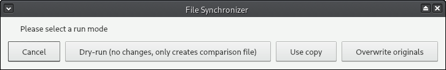
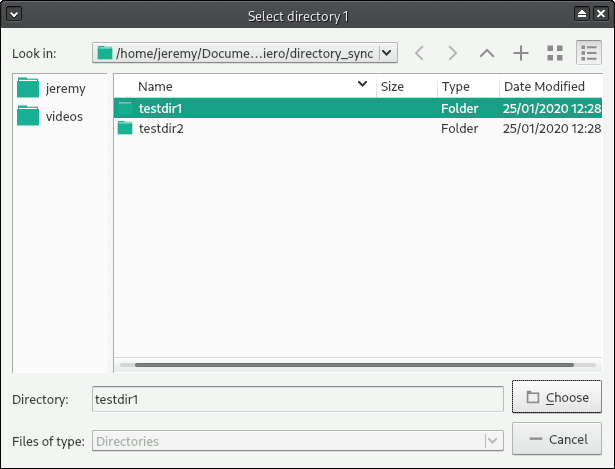

# Directory Synchronizer

Directory synchronizer in Python. Also finds duplicate files, and keeps only the most recent copy of each file. 

# Usage

* Double click on `run_synchronizer.bat` in file explorer. 
  This will launch the simple graphical user interface (GUI). 

* You are presented with a small window with several buttons: 
    * `Cancel`: Cancels the operation, nothing else happens
    * `Dry-run`: Performs a comparison and creates a text-file report without 
       performing any changes to the folders
    * `Use copy`: Creates a back-up of the selected folders before performing the comparison and synchronization
    * `Overwrite originals`: Performs comparison and synchronization of selected folders, *without creating a backup* 

* Once you select one of the run modes (other than cancel), you will be prompted to select the two folders to synchronize. 
* For each of the two folders, once the target folder/drive is selected, press the `Choose` button at the 
  botton right of the folder selection dialog. 

In the above example, `testdir1` is the first folder to be synchronized. At this point, as the folder 
is selected, press the `Choose` button. You will then be prompted to select the second folder. 

* Once both folders are selected, the console (black background) window will show the progress and any 
informative text as the operation proceeds. 
* Once the seleected operation has completed, you may review the `comparison.txt` file which is created in the 
Python script folder (the same folder where the original `run_synchronizer.bat` file is located. 

